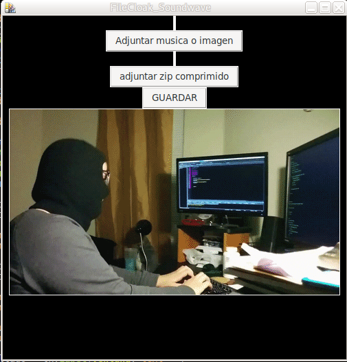

<<!DOCTYPE html>
<html>
<head>
</head>
<body>
	<h1>FileCloak_Soundwave</h1> 
	 
	

		Una herramienta simple escrita en python3 y usa la libreria de tkinter 
		su uso es basico, funciona para ocultar archivos zip dentro de imagenes o archivos 
		mp3, solo lo ejecutas con python3 run.py y luego seleccionas 
		el archivo mp3, png, jpg en el que ocultaras el contenido de archivos comprimidos 
		despues de eso seleccionaras el zip que quieres ocultar y simplemente le das en  
		guardar y listo, se generara un fichero llamado musica.mp3 
	

</body>
</html>